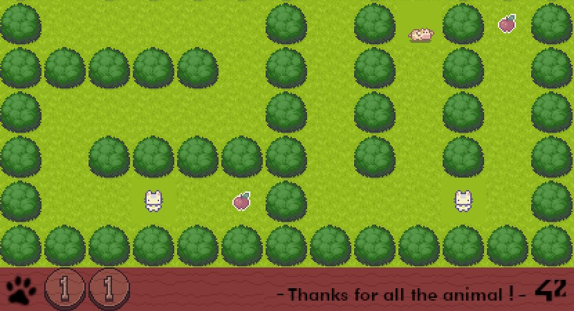
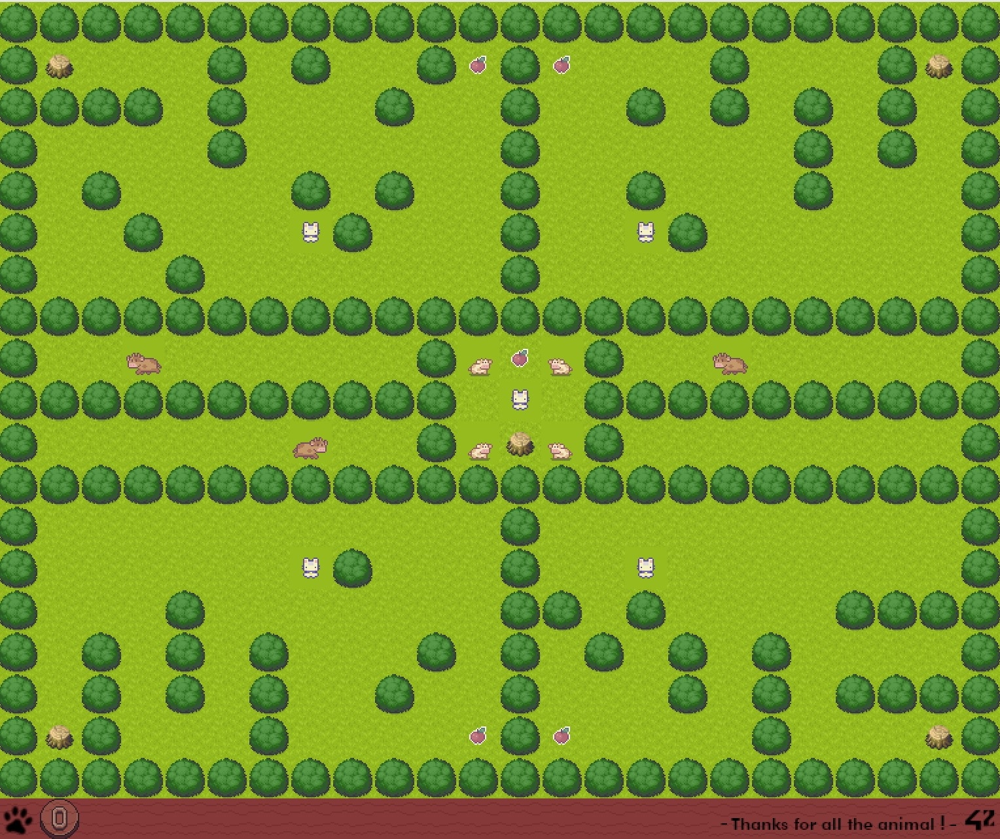

# So Long (project of 42 Tokyo)
-- And thanks for all the animal! --  
  
  

## What is this ?
This is a simple 2D game, written in C. You operate characters to collect fruits.  
After collecting all, head for the stump and escape from the Earth!
  
  

## How to play ?
This game works on Linux.  
Although it works on Mac OS, the rendering may be unstable (Now we are optimizing it, so please wait...).  
  
  

### Installation
Please clone this repository as follows.  
```
git clone https://github.com/tmuramat081/42_so_long.git  
cd 42_so_long  
make play  
```
### Game rules
- The player’s goal is to collect every items present on the map, then escape
chosing the shortest possible route.
- You can use WASD (or allow) keys to move the main character.
- The player is able to move in these 4 directions: up, down, left, right.
- The player should not be able to move into walls.

## Thecnical issues
- Sprite animation
- Multiple characters
- Limiter of max FPS
- Linier interpolation (LERP)

## Reference
### Data structure  
https://gitmind.com/app/flowchart/a4010228373
### Flow diagram  
https://gitmind.com/app/flowchart/9ce10244397

## Thanks
- This game uses the following image materials.  
"Sprout Lands" by Cup Nooble  
https://cupnooble.itch.io/sprout-lands-asset-pack  

- *And thanks for all the student, staff, sponser of 42 Tokyo!*  
https://42tokyo.jp/

## Authors
Taisei Muramatsu (tmuramat)
